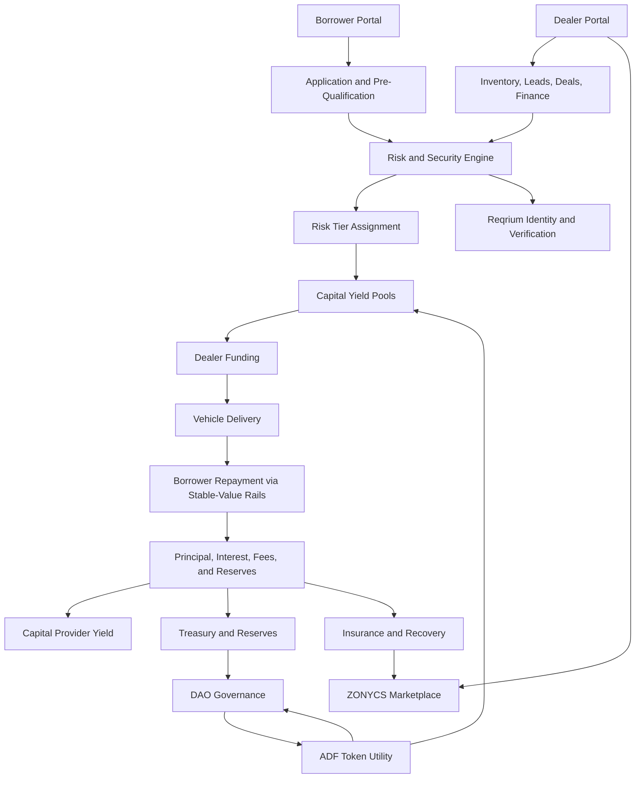
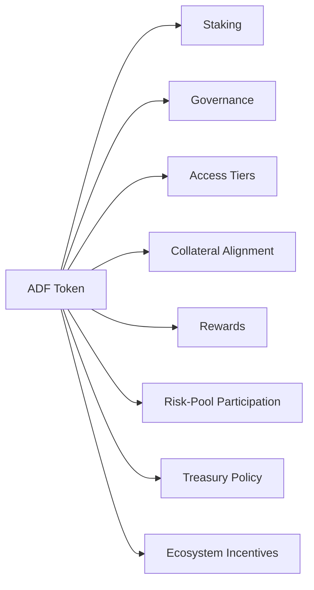
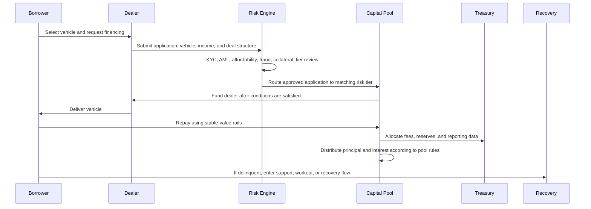
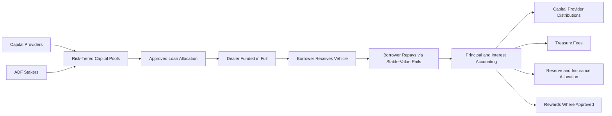
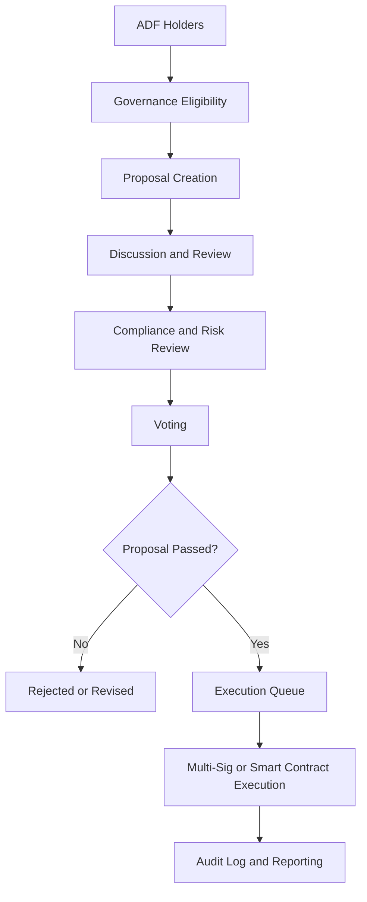
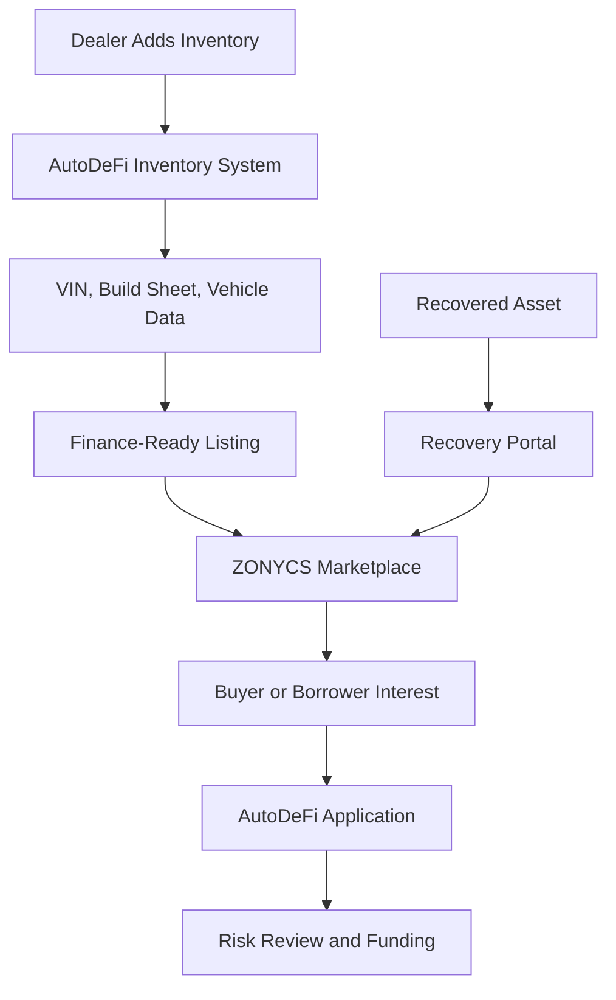

# AutoDeFi Whitepaper V2

## Decentralized Vehicle Financing on Hedera

**Project:** AutoDeFi  
**Token:** ADF  
**Ecosystem:** Voltaire Protocols  
**Marketplace Layer:** ZONYCS  
**Identity and Verification Layer:** Reqrium  
**Network Direction:** Hedera Hashgraph  
**Document Version:** V2  
**Status:** Investor-facing working draft for product, protocol, token, compliance, and ecosystem planning

---

## Important Notice

This whitepaper is a working project document. It describes the proposed AutoDeFi ecosystem, ADF token utility, vehicle financing workflow, portal architecture, risk model, treasury design, governance model, and roadmap.

Nothing in this document is financial advice, legal advice, tax advice, investment advice, a securities offering, a lending approval, a guarantee of yield, a guarantee of liquidity, or a guarantee of token value. Any future AutoDeFi product, ADF token launch, staking program, lending program, dealer program, capital provider program, DAO governance process, marketplace feature, insurance feature, or yield distribution must be reviewed by qualified legal, compliance, tax, lending, securities, and security professionals before launch.

AutoDeFi must comply with all applicable laws and regulations in every jurisdiction where it operates, including consumer lending, securities, privacy, data protection, KYC, AML, sanctions, advertising, dealer licensing, payment, debt collection, repossession, and tax rules.

---

# Table of Contents

1. Executive Summary  
2. Vision  
3. Market Problem  
4. AutoDeFi Solution  
5. Ecosystem Architecture  
6. Participant Overview  
7. Product Modules  
8. ADF Token Overview  
9. ADF Token Utility  
10. Proposed Tokenomics Framework  
11. Loan Lifecycle  
12. Risk Tier Model  
13. Borrower Portal  
14. Dealer Portal  
15. Capital Yield Portal  
16. DAO and Community Portal  
17. Risk and Security Portal  
18. Insurance and Recovery Portal  
19. Admin Command Center  
20. Funding, Repayment, and Yield Flow  
21. Treasury and Reserve Design  
22. Governance Model  
23. Identity, Verification, and Compliance  
24. Smart Contract and Protocol Security  
25. ZONYCS Marketplace Integration  
26. Data, Reporting, and Transparency  
27. Roadmap  
28. Risk Factors  
29. Future Expansion  
30. Conclusion  
31. Disclaimer

---

# 1. Executive Summary

AutoDeFi is a decentralized vehicle financing protocol designed to connect borrowers, dealers, capital providers, insurance and recovery systems, risk operators, and DAO governance into one transparent auto-loan ecosystem.

The traditional auto finance industry is highly fragmented. Borrowers often face unclear approvals, high interest rates, inconsistent loan terms, and limited visibility into their financing options. Dealers lose time and revenue when lender approvals are slow, funding conditions are unclear, or customers fall outside conventional credit boxes. Capital providers may want exposure to real-world auto-loan yield, but they often lack transparent, risk-tiered, and programmable access to vehicle-backed credit markets.

AutoDeFi introduces a new model: a blockchain-supported auto finance operating system where vehicle loans are originated through borrower and dealer portals, funded through structured capital pools, monitored through risk and compliance systems, and governed over time by the ADF token ecosystem.

The ADF token is designed as the utility and governance coordination layer of AutoDeFi. ADF supports staking, access, collateral alignment, governance participation, rewards, risk-pool signaling, dealer incentives, and treasury policy. ADF is not intended to be the default borrower repayment currency. Borrowers are expected to repay approved loans through regional stable-value rails where legally and technically supported.

AutoDeFi is being designed around Hedera Hashgraph because the protocol requires fast settlement, predictable fees, high throughput, auditability, and infrastructure suitable for real-world financial workflows.

At maturity, AutoDeFi is designed to support:

- Borrower pre-qualification, applications, loan management, payments, refinance, protection products, documents, rewards, and support.
- Dealer inventory, leads, deals, finance submissions, F&I products, marketplace listings, approvals, funding status, and reports.
- Capital provider dashboards, loan marketplace access, risk-tiered pools, portfolio analytics, statements, earnings, and auto-invest controls.
- DAO governance, proposals, voting, delegation, treasury review, staking, token utility, revenue policy, and audit history.
- Risk and security systems for identity verification, fraud detection, bank review, exposure monitoring, transaction monitoring, smart contract security, and compliance.
- Insurance and recovery workflows for claims, delinquency, collections, repossession, recovery assets, workouts, payment plans, and reporting.
- ZONYCS marketplace integration for public vehicle listings, dealer inventory, auctions, sales, raffles where legal, and recovery asset routing.
- Reqrium identity and verification support within the broader Voltaire Protocols ecosystem.

AutoDeFi is not simply a lending app. It is designed to become a full-stack decentralized auto finance protocol.

---

# 2. Vision

The AutoDeFi vision is to make vehicle financing more transparent, programmable, and accessible while preserving responsible underwriting, compliance, borrower protection, and real-world collateral discipline.

AutoDeFi aims to create an ecosystem where:

- Borrowers understand their financing options before they commit.
- Dealers can submit, structure, track, and fund deals more efficiently.
- Capital providers can choose structured exposure by risk tier.
- Token holders can participate in governance and ecosystem coordination.
- Risk operators can monitor fraud, exposure, collateral, and compliance in real time.
- The community can help shape treasury policy and long-term protocol direction.

The protocol is designed to connect real-world vehicle financing with blockchain-based transparency, but without ignoring the legal and operational requirements of lending.

AutoDeFi’s long-term goal is to become a decentralized operating layer for auto loans, vehicle-backed credit, dealer funding, and mobility-related financial products.

---

# 3. Market Problem

Vehicle ownership is essential for many people. It affects employment, education, family care, independence, business access, and regional mobility. Yet vehicle financing can be expensive, confusing, and inaccessible.

## 3.1 Borrower Problems

Borrowers may face:

- High interest rates, especially when credit is challenged.
- Unclear approval criteria.
- Limited explanation after declines.
- Complex payment schedules.
- Difficulty comparing total repayment cost.
- Weak visibility into payoff, refinance, insurance, collateral, or protection product status.
- Few options when traditional lender rules do not fit their profile.
- Lack of clear reward systems for responsible repayment behavior.

## 3.2 Dealer Problems

Dealers may face:

- Slow lender approvals.
- Repetitive submissions to multiple lenders.
- Unclear funding conditions.
- Delayed funding.
- Lost deals when a borrower does not fit a lender’s approval box.
- Disconnected inventory, sales, finance, and marketplace systems.
- Limited access to alternative capital.

## 3.3 Capital Provider Problems

Capital providers may face:

- Limited access to real-world auto-loan yield.
- Low transparency into risk composition.
- Difficulty comparing pools by borrower quality, collateral, down payment, vehicle type, term, dealer source, or performance.
- Limited control over exposure to conservative versus higher-risk loan segments.
- Weak reporting on delinquency, reserves, recovery, and loss performance.

## 3.4 Protocol Opportunity

AutoDeFi exists because the auto finance process can be made more transparent, modular, and programmable.

A properly designed decentralized vehicle financing protocol can:

- Improve borrower visibility.
- Improve dealer workflow.
- Create structured capital pool access.
- Separate risk tiers.
- Improve auditability.
- Align token utility with real-world protocol activity.
- Enable community governance over non-restricted protocol policy.

---

# 4. AutoDeFi Solution

AutoDeFi proposes a decentralized auto finance ecosystem built around dedicated portals, smart contract accounting, risk-tiered pools, identity verification, dealer workflows, and DAO governance.

The core solution connects six major participant groups:

1. **Borrowers** who need vehicle financing, loan management, payment tools, refinancing, documents, insurance, and support.
2. **Dealers** who need inventory management, lead pipelines, finance submissions, F&I tools, approvals, and funding workflows.
3. **Capital providers** who want structured exposure to vehicle-backed credit pools.
4. **ADF stakers and token holders** who support access, governance, staking, collateral alignment, and ecosystem incentives.
5. **Risk and compliance operators** who monitor identity, fraud, underwriting, collateral, exposure, transactions, and security.
6. **DAO participants** who help guide treasury policy, proposals, voting, audits, and protocol expansion.

The simplified AutoDeFi flow is:

1. A borrower applies directly or through a dealer.
2. Identity, compliance, affordability, collateral, and risk checks are completed.
3. The application is assigned to a risk tier.
4. An approved deal is matched to the appropriate capital pool.
5. The dealer is funded in full after approval conditions are satisfied.
6. The borrower repays through stable-value rails.
7. Interest and principal are accounted for through the protocol.
8. Yield is distributed to the matching capital providers or pool participants according to pool rules.
9. Treasury, reserves, insurance, rewards, and governance rules are applied.
10. Delinquency, recovery, and reporting workflows activate when required.

---

# 5. Ecosystem Architecture

The AutoDeFi architecture is designed as a modular ecosystem. Each major portal has its own user role, but all portals connect through shared data, verification, risk, funding, and reporting systems.

## 5.1 Core Architecture Layers

| Layer | Purpose |
|---|---|
| User Portals | Borrower, dealer, capital provider, DAO, risk, insurance, admin |
| Identity Layer | KYC, AML, wallet verification, dealer verification, Reqrium reputation support |
| Risk Layer | Credit rules, fraud detection, bank review, exposure monitoring, collateral checks |
| Funding Layer | Capital pools, dealer funding, loan accounting, repayment tracking |
| Token Layer | ADF staking, access, governance, rewards, collateral alignment |
| Marketplace Layer | ZONYCS listings, auctions, sales, dealer inventory, recovery assets |
| Governance Layer | DAO proposals, voting, treasury, delegation, audits, policy updates |
| Compliance Layer | Jurisdiction controls, privacy, lending rules, disclosures, reporting |

---

# 6. Participant Overview

| Participant | Primary Goal | AutoDeFi Benefit |
|---|---|---|
| Borrower | Finance or refinance a vehicle | Clear options, dashboard, payment tools, rewards, support |
| Dealer | Sell and finance vehicles | Faster submissions, deal tracking, funding visibility, marketplace tools |
| Capital Provider | Access vehicle-backed yield | Risk-tiered pools, reporting, portfolio controls |
| ADF Holder | Participate in protocol utility and governance | Staking, voting, access, rewards, ecosystem participation |
| Risk Operator | Protect the protocol | Fraud checks, exposure monitoring, compliance workflows |
| DAO Member | Shape protocol policy | Proposals, voting, treasury oversight, delegation |
| Recovery Operator | Manage delinquency and collateral | Collections, claims, repossession, recovery asset routing |
| Admin | Manage approved operations | Role-based command center and audit logs |

---

# 7. Product Modules

AutoDeFi is designed as a full product suite rather than a single feature.

| Module | Description |
|---|---|
| Borrower Portal | Pre-qualification, loan applications, payments, refinance, insurance, documents, rewards |
| Dealer Portal | Inventory, leads, deals, finance submissions, customers, auctions, reports, F&I tools |
| Capital Yield Portal | Pools, loan marketplace, portfolios, earnings, transactions, reports, auto-invest |
| DAO Portal | Proposals, voting, treasury, delegation, tokenomics, community, announcements |
| Risk and Security Portal | Risk overview, fraud detection, exposure monitor, identity, compliance, alerts |
| Insurance and Recovery Portal | Claims, delinquency, collections, repossession, recovery assets, workouts |
| Admin Command Center | Profile, wallet, KYC, notifications, borrow, invest, staking, marketplace, dealer access |
| ZONYCS Marketplace | Vehicle listings, auctions, sales, raffles where legal, dealer inventory, recovery assets |
| Reqrium Verification | Identity, reputation, wallet verification, flagged-risk support where legally permitted |

---

# 8. ADF Token Overview

ADF is the proposed utility token for AutoDeFi.

ADF is designed to coordinate access, staking, collateral alignment, governance, rewards, risk-pool participation, treasury policy, and ecosystem incentives.

ADF is not intended to be the default borrower loan repayment currency. Auto loans require predictable repayment values. Borrower repayments are expected to use regional stable-value rails where legally and technically available. ADF remains the protocol utility and governance layer.

## 8.1 ADF Positioning

| Category | Direction |
|---|---|
| Token Name | AutoDeFi Token |
| Token Symbol | ADF |
| Primary Network Direction | Hedera Hashgraph |
| Core Role | Utility, staking, access, governance, collateral alignment, rewards |
| Loan Payment Currency | Regional stable-value rails, not default ADF |
| Governance Role | DAO voting, proposals, delegation, treasury policy |
| Risk Role | Pool participation, staking alignment, collateral support where approved |
| Status | Proposed design, subject to legal and compliance review |

---

# 9. ADF Token Utility

ADF utility is divided into seven core categories.

## 9.1 Staking

ADF holders may stake tokens into approved staking contracts. Staking can support access rights, governance weight, rewards eligibility, collateral alignment, or participation in selected risk-tier pools.

Staking rules must be clear before deployment, including lock periods, withdrawal windows, reward formulas, risk exposure, slashing rules if any, and eligibility requirements.

## 9.2 Collateral Alignment

Borrowers may be able to use staked ADF as part of a collateral-support model for higher-quality loan tiers, subject to underwriting, compliance, and legal review.

ADF collateral support is not a substitute for responsible lending. It is an additional alignment tool.

## 9.3 Governance

ADF may allow token holders to participate in DAO governance, including proposals, voting, delegation, treasury policy, protocol upgrades, fee policy, incentive programs, and risk-limit changes.

## 9.4 Rewards

ADF may support rewards for responsible participation, including:

- On-time borrower repayment.
- Dealer performance.
- Capital provider loyalty.
- Staking participation.
- Governance participation.
- Referral programs.
- Marketplace engagement.

Rewards must be designed carefully to avoid unfair lending incentives, abusive behavior, or regulatory conflicts.

## 9.5 Access and Tiering

ADF may provide access to advanced analytics, dealer tools, governance functions, capital dashboards, marketplace features, or premium reporting.

Borrower protections and legally required disclosures should never depend on token ownership.

## 9.6 Risk-Pool Participation

ADF staking may help participants signal or support exposure to selected risk pools. A conservative participant may prefer Tier 1 exposure, while a higher-risk participant may choose another pool if legally eligible.

## 9.7 Ecosystem Incentives

ADF may support incentives across AutoDeFi, ZONYCS, Reqrium, and the broader Voltaire Protocols ecosystem.

---

# 10. Proposed Tokenomics Framework

The following tokenomics model is a planning framework only. It is not a final token allocation, not a sale structure, not an investment offer, and not a guarantee of launch terms. Final tokenomics must be reviewed by qualified legal, securities, tax, and compliance professionals.

## 10.1 Proposed Planning Allocation

| Allocation Category | Proposed Share | Purpose |
|---|---:|---|
| Ecosystem Incentives and Rewards | 20% | Borrower rewards, dealer incentives, marketplace activity, referral systems, education |
| Capital Pool and Liquidity Support | 20% | Protocol liquidity programs, risk-pool bootstrapping, reserve support subject to legal review |
| Treasury and DAO Reserve | 15% | Long-term protocol reserves, grants, audits, operations, emergency support |
| Team and Contributors | 15% | Builders, maintainers, advisors, operations, vesting-based contributor alignment |
| Dealer and Strategic Partnerships | 10% | Dealer onboarding, marketplace partnerships, integration partners, regional pilots |
| Staking and Governance Rewards | 10% | Governance participation, staking incentives, delegation programs, long-term alignment |
| Compliance, Security, and Audits | 5% | Legal review, compliance systems, smart contract audits, risk tools, bug bounties |
| Community Growth | 5% | Community campaigns, early user programs, education, ecosystem activation |

## 10.2 Suggested Vesting Logic

| Category | Suggested Vesting Direction |
|---|---|
| Team and Contributors | Multi-year vesting with cliff and ongoing unlocks |
| Treasury and DAO Reserve | Governance-controlled release schedule |
| Ecosystem Rewards | Program-based release tied to measurable activity |
| Dealer Partnerships | Milestone-based release tied to real dealer onboarding and performance |
| Staking Rewards | Emissions schedule controlled by governance and risk policy |
| Compliance and Audits | Reserved for direct operational use, not speculative distribution |

## 10.3 Token Design Rules

ADF tokenomics should follow these rules:

- No promise of guaranteed profit.
- No guaranteed yield.
- No launch before legal review.
- No public staking program before compliance review.
- No misleading rewards language.
- No borrower dependency on token ownership for required protections.
- Clear disclosure of lockups, emissions, treasury use, and risks.
- Governance controls for major emissions and treasury decisions.

---

# 11. Loan Lifecycle

The loan lifecycle connects borrowers, dealers, risk systems, capital pools, repayment, reporting, and recovery.

## 11.1 Lifecycle Stages

| Stage | Description |
|---|---|
| Application | Borrower applies directly or through dealer |
| Verification | KYC, AML, identity, employment, income, bank review when required |
| Vehicle Review | VIN, valuation, collateral, history, lien, insurance |
| Risk Tiering | Tier 1, Tier 2, Tier 3, or Tier 4 routing |
| Approval | Conditions, disclosures, contract, funding readiness |
| Dealer Funding | Dealer receives full funded amount after conditions are met |
| Repayment | Borrower repays through stable-value rails |
| Yield Distribution | Interest flows to matching capital pools according to rules |
| Servicing | Payments, documents, support, refinance, protection products |
| Recovery | Delinquency, workout, collections, repossession, recovery asset routing |

---

# 12. Risk Tier Model

AutoDeFi uses four primary risk tiers.

| Tier | Description | Possible Qualification Direction | Protocol Outcome |
|---|---|---|---|
| Tier 1 | Strongest support profile | Staked ADF collateral or more than one-third down, strong affordability, verified identity | Best available protocol rate, lowest risk-pool exposure |
| Tier 2 | Good credit plus token/down support | Good credit, token-supported down payment or staking support, verified income | Strong approval path with moderate risk |
| Tier 3 | Good credit, no money down | Good credit, acceptable affordability, strong collateral, no down payment | Higher risk than Tier 1 or Tier 2 due to lower borrower equity |
| Tier 4 | Last chance lead routing | Applicant does not meet AutoDeFi protocol rules | Routed to local dealer or off-platform partner where appropriate |

## 12.1 Tier 1 — Strongest Risk Profile

Tier 1 is designed for borrowers with the strongest support profile.

Potential signals:

- Staked ADF collateral support, or
- More than one-third down payment.
- Strong income and affordability.
- Verified identity.
- Strong vehicle collateral.
- Acceptable loan-to-value.

## 12.2 Tier 2 — Good Credit Plus Token or Down Support

Tier 2 is designed for borrowers with a good credit profile and additional support through token-backed alignment or down payment structure.

## 12.3 Tier 3 — Good Credit, No Money Down

Tier 3 is designed for good-credit borrowers who may not have a down payment. Because borrower equity is lower, pricing and pool exposure may be higher.

## 12.4 Tier 4 — Last Chance Lead Routing

Tier 4 protects the protocol by keeping unsuitable loans out of AutoDeFi funding pools while still giving the applicant a possible next step through a local dealer or alternative off-platform lender.

---

# 13. Borrower Portal

The Borrower Portal is the user dashboard for pre-qualification, loan applications, active loans, payments, insurance, documents, refinance, rewards, wallet access, and support.

## 13.1 Borrower Modules

| Module | Purpose |
|---|---|
| Dashboard | Overview of application, loan, payments, rewards, support |
| Pre-Qualification | Estimate options before full submission |
| Loan Application | Full application with identity, income, residence, employment, vehicle, terms |
| My Loans | Active loan status, balance, payoff, term, interest, payment history |
| Payments | Weekly, bi-weekly, semi-monthly, monthly, early payout where permitted |
| Autopay | Automated payment setup through supported rails |
| Refinance | Review refinance eligibility and improved terms |
| Insurance and Protection | Tire and rim, scratch and dent, extended warranty, claims support |
| Documents | Contracts, disclosures, identity docs, loan docs, insurance docs |
| Collateral | Vehicle information, lien status, insurance status, valuation |
| Rewards | Responsible repayment rewards and ecosystem incentives |
| Wallet | Wallet connection and ADF participation features |
| Support | Questions, disputes, payment help, hardship support |
| Settings | Profile, notifications, preferences, privacy |

## 13.2 Borrower Protection Principles

AutoDeFi should provide:

- Clear loan terms.
- Clear total repayment cost.
- Clear payment schedule.
- Early payout visibility.
- Plain-language disclosures.
- Support before collections escalation.
- Transparent refinance options.
- Privacy-preserving data handling.

---

# 14. Dealer Portal

The Dealer Portal is designed for dealerships, finance managers, sales teams, and dealer administrators.

## 14.1 Dealer Modules

| Module | Purpose |
|---|---|
| Dashboard | Leads, deals, approvals, inventory, funding, performance |
| Inventory | Add vehicles, VIN decode, build sheets, vehicle history, pricing, status |
| Leads | New, contacted, qualified, follow-up, lost/closed |
| Deals | New, in progress, submitted, pending, approved, funded, declined |
| Finance | Application submission, deal structure, lender-style conditions, tier options |
| Customers | Borrower profiles, documents, communication history |
| Referrals | Dealer referral and partner tracking |
| Auctions | ZONYCS auction, raffle where legal, sale routing |
| Reports | Funded deals, approval rate, performance, inventory, F&I tracking |
| F&I Products | Warranty, tire and rim, scratch and dent, protection products |
| Marketing Tools | Marketplace promotion, vehicle campaigns, dealer branding |
| Settings | Dealer profile, users, permissions, integrations |

## 14.2 Dealer Funding Principle

Once an application is approved and all conditions are satisfied, AutoDeFi is designed to fund the dealer in full. The borrower then repays the loan over time according to the approved contract.

---

# 15. Capital Yield Portal

The Capital Yield Portal is designed for approved capital providers, staking participants, pool managers, treasury operators, and eligible investors.

## 15.1 Capital Modules

| Module | Purpose |
|---|---|
| Dashboard | Capital allocated, pool exposure, earnings, risk, distributions |
| Investments | Active and historical allocations |
| Loan Marketplace | Risk-tiered loan or pool review, depending on final legal structure |
| Portfolios | Pool composition, tier exposure, term exposure, dealer exposure |
| Earnings | Realized and pending distributions |
| Transactions | Deposits, withdrawals, allocations, distributions |
| Reports and Analytics | Performance, delinquency, reserves, recovery, yield |
| Auto-Invest | Rules-based allocation controls |
| Documents | Statements, disclosures, tax docs where applicable |
| Settings | Risk preference, notifications, account controls |
| Support | Capital provider support and education |

## 15.2 Capital Provider Controls

Eligible capital providers may define:

- Maximum allocation per pool.
- Preferred risk tier.
- Minimum reserve coverage.
- Maximum term.
- Dealer restrictions.
- Geographic restrictions.
- Collateral requirements.
- Yield range preference.
- Liquidity preference.

Yield is not guaranteed. Capital participants must understand default risk, liquidity risk, recovery risk, regulatory risk, and smart contract risk.

---

# 16. DAO and Community Portal

The DAO and Community Portal allows ADF participants to help guide AutoDeFi’s protocol direction, treasury use, and ecosystem development.

## 16.1 DAO Modules

| Module | Purpose |
|---|---|
| Dashboard | Governance overview, active votes, treasury summary |
| Proposals | Create and review governance proposals |
| Voting | Vote on eligible proposals |
| Treasury | Assets, reserves, spending, allocations, audits |
| Tokenomics | Supply, emissions, utility, allocation, governance data |
| Delegation | Delegate voting power to trusted representatives |
| Members | DAO participants and roles |
| Forum | Community discussion and governance debate |
| Announcements | Protocol updates and official notices |
| Reports and Analytics | Governance history, proposal performance, treasury analytics |
| Resources | Education, docs, policies, governance guides |
| Settings | Preferences and governance profile |

## 16.2 Governance Scope

DAO governance may include:

- Treasury spending proposals.
- Reserve policy changes.
- Reward program changes.
- Protocol upgrades.
- Dealer incentive programs.
- Capital pool settings.
- Marketplace expansion.
- Audit funding.
- Community grants.

Certain legally restricted decisions may require professional control, regulated entity approval, or compliance review before execution.

---

# 17. Risk and Security Portal

The Risk and Security Portal protects the protocol from fraud, excessive exposure, compliance failures, and smart contract vulnerabilities.

## 17.1 Risk Modules

| Module | Purpose |
|---|---|
| Dashboard | Risk summary and priority alerts |
| Risk Overview | Portfolio-level exposure, tier health, delinquencies |
| Fraud Detection | Synthetic identity, duplicate applications, dealer anomalies |
| Security Events | Account, wallet, admin, API, and smart contract events |
| Exposure Monitor | Dealer, geography, vehicle, LTV, tier, term, borrower concentration |
| Transaction Monitoring | Repayment, funding, treasury, staking, withdrawal monitoring |
| Smart Contract Security | Contract status, audits, alerts, upgrade controls |
| Identity Verification | KYC, AML, sanctions, document, wallet, dealer verification |
| Compliance | Jurisdiction rules, disclosures, regulatory workflows |
| Reports and Analytics | Risk reports, audit logs, trend analysis |
| Alerts and Notifications | Automated risk alerts and escalation workflows |
| Settings | Integrations, security, notifications, audit logs, API keys, data rules |

## 17.2 Risk Settings

Risk and Security settings may include:

- Integrations.
- Security.
- Notifications.
- System.
- Data retention.
- Audit logs.
- Appearance.
- Access and authentication.
- API keys.
- IP allow list.
- Session management.
- Data sources.
- Webhooks.
- Risk rules and policies.
- System maintenance.

---

# 18. Insurance and Recovery Portal

The Insurance and Recovery Portal supports protection products, claims, delinquency, collections, repossession, recovery assets, workouts, and payment plans.

## 18.1 Recovery Modules

| Module | Purpose |
|---|---|
| Dashboard | Recovery and delinquency overview |
| Insurance Claims Center | Claims intake, review, status, documents |
| Collections | Missed payment workflows and borrower communication |
| Delinquent Loans | Past-due accounts and escalation status |
| Recovery Pipeline | Recovery status and legal process tracking |
| Repossession Queue | Repossession status and vendor management |
| Recovery Assets | Recovered vehicle inventory |
| Workouts | Modified payment arrangements and hardship solutions |
| Payment Plans | Structured catch-up plans |
| Reports | Delinquency, recovery, loss, claim, and performance reports |
| Analytics | Loss trends, recovery rates, reserve impact |

## 18.2 Recovery Principles

The recovery process should prioritize:

- Early support.
- Clear communication.
- Legal compliance.
- Fair borrower treatment.
- Accurate documentation.
- Transparent pool loss accounting.
- Recovery asset routing through ZONYCS where permitted.

---

# 19. Admin Command Center

The Admin Command Center gives approved operators a role-based operational view.

Core Admin modules include:

- Profile.
- Wallet.
- KYC verified.
- Notifications.
- Borrow.
- Invest.
- Insurance pool.
- DAO governance.
- Staking rewards.
- Marketplace.
- Dealer access.
- Apply now.

All admin actions should be permissioned, logged, monitored, and reviewable.

---

# 20. Funding, Repayment, and Yield Flow

AutoDeFi separates loan repayment from ADF token utility.

## 20.1 Funding Flow

## 20.2 Core Rules

| Rule | Direction |
|---|---|
| Dealer Funding | Dealer is funded in full after approval conditions are satisfied |
| Borrower Repayment | Borrower repays using stable-value rails where supported |
| ADF Role | ADF is utility, staking, governance, collateral alignment, rewards, and access |
| Yield Source | Borrower interest payments and protocol-defined pool rules |
| Yield Guarantee | No guaranteed yield |
| Risk Matching | Yield flows to matching risk-tier pools according to rules |
| Reserves | Reserves support protocol stability and loss management |

---

# 21. Treasury and Reserve Design

The AutoDeFi treasury is designed to support long-term protocol health.

## 21.1 Treasury Functions

Treasury functions may include:

- Holding protocol-owned assets.
- Managing reserves.
- Funding development.
- Funding audits.
- Funding legal and compliance review.
- Supporting insurance pools.
- Supporting dealer onboarding.
- Supporting liquidity and capital programs where legally permitted.
- Funding approved DAO proposals.
- Supporting emergency response.

## 21.2 Treasury Management Center

| Module | Purpose |
|---|---|
| Assets | Treasury asset overview |
| Allocation | Allocation by reserve, operations, incentives, audits, growth |
| Revenue Streams | Fees, protocol revenue, marketplace revenue where applicable |
| Reserves | Loss reserves, emergency reserves, insurance support |
| Expenditures | Spending history and approved budgets |
| Budgeting | Operating budgets and forecasts |
| Reports | Treasury reports and statements |
| Audit Logs | All treasury actions and changes |
| Transfer Funds | Permissioned transfers with controls |
| Swap or Convert | Approved asset conversion controls |
| Stake Assets | Treasury staking where allowed |
| Approved Spending | DAO-approved and admin-approved spending |
| Treasury Proposal | Governance-linked spending requests |
| Analytics Performance | Treasury performance and reserve health |
| Cash Flow | Incoming and outgoing flow analysis |
| Scenario Planning | Stress tests and reserve scenarios |
| Policies and Rules | Treasury policy management |
| Multi-Signature | Multi-party approval and security |
| Integrations | Banking, custody, accounting, reporting integrations |
| Settings | Treasury configuration and permissions |

---

# 22. Governance Model

AutoDeFi governance should decentralize protocol policy over time while preserving required legal, compliance, and operational controls.

## 22.1 Governance Areas

Governance may include:

- Proposal creation.
- Voting.
- Delegation.
- Treasury approvals.
- Reserve policy changes.
- Risk parameter updates.
- Reward program changes.
- Dealer program rules.
- Capital pool rules.
- Marketplace expansion.
- Audit funding.
- Protocol upgrade approvals.
- Emergency response procedures.

## 22.2 Governance Limits

Not every decision should be fully open to token voting. Some areas may require licensed professionals, regulated entities, or restricted committees, including:

- Lending approvals.
- Consumer disclosures.
- Debt collection policy.
- Securities compliance.
- Tax reporting.
- Privacy and data protection.
- Sanctions compliance.
- KYC and AML controls.
- Repossession and legal enforcement.

---

# 23. Identity, Verification, and Compliance

AutoDeFi must be compliance-first.

## 23.1 Verification Requirements

Identity and verification may include:

- Borrower KYC.
- AML screening.
- Sanctions checks.
- Dealer verification.
- Capital provider verification.
- Wallet verification.
- Document verification.
- Address verification.
- Employment verification.
- Income verification.
- Bank review when required.
- Vehicle ownership and lien checks.
- Insurance verification.
- Reqrium identity and reputation support where legally permitted.

## 23.2 Compliance Areas

Compliance areas may include:

- Consumer lending laws.
- Securities laws.
- Privacy laws.
- Data protection rules.
- Anti-money laundering laws.
- Sanctions rules.
- Advertising rules.
- Dealer licensing rules.
- Debt collection rules.
- Repossession rules.
- Tax reporting.
- Stablecoin and payment rules.
- Jurisdiction restrictions.

## 23.3 Compliance Principle

AutoDeFi should only offer products in jurisdictions where the product, token feature, lending model, payment rail, staking model, capital participation structure, and marketplace feature are legally permitted.

---

# 24. Smart Contract and Protocol Security

AutoDeFi requires layered security because it may involve borrower data, capital pools, ADF staking, treasury assets, loan accounting, repayments, rewards, governance, and recovery workflows.

## 24.1 Security Controls

Security controls should include:

- Smart contract audits.
- Treasury multi-signature controls.
- Role-based permissions.
- Emergency pause functions.
- Upgrade controls.
- Transaction monitoring.
- Audit logs.
- Bug bounty planning.
- Key management.
- Access controls.
- API security.
- Front-end validation.
- Back-end validation.
- Data encryption.
- Secure wallet connection.
- Admin action review.
- Penetration testing.
- Incident response planning.

## 24.2 Security Principle

No single admin key, oracle, contract, database, or front-end system should be able to compromise the entire protocol without layered checks, logging, monitoring, and recovery controls.

---

# 25. ZONYCS Marketplace Integration

ZONYCS is the marketplace layer connected to AutoDeFi.

ZONYCS may support:

- Dealer vehicle listings.
- Public vehicle discovery.
- Auctions.
- Raffles where legally permitted.
- Direct vehicle sales.
- Dealer branding.
- Marketplace promotions.
- Recovery asset resale.
- Inventory visibility.
- Future franchise or dealership marketplace tools.

## 25.1 Marketplace Flow

---

# 26. Data, Reporting, and Transparency

AutoDeFi should provide transparent reporting without exposing private borrower data.

## 26.1 Borrower Reporting

Borrowers should see:

- Application status.
- Loan terms.
- Payment schedule.
- Payoff estimate.
- Protection products.
- Documents.
- Rewards.
- Support status.

## 26.2 Dealer Reporting

Dealers should see:

- Leads.
- Applications.
- Approval status.
- Funded deals.
- Inventory.
- Marketplace listings.
- Dealer performance.
- F&I product performance.

## 26.3 Capital Provider Reporting

Capital providers should see:

- Pool allocation.
- Risk-tier exposure.
- Expected and realized yield.
- Delinquency.
- Losses.
- Reserves.
- Recovery proceeds.
- Historical performance.

## 26.4 DAO Reporting

DAO participants should see:

- Treasury assets.
- Proposals.
- Voting history.
- Spending.
- Protocol performance.
- Governance history.
- Audit logs.

## 26.5 Risk Reporting

Risk operators should see:

- Fraud alerts.
- Exposure concentration.
- Underwriting exceptions.
- Transaction anomalies.
- Compliance flags.
- Smart contract alerts.

---

# 27. Roadmap

## Phase 1 — Front-End Foundation

- Complete React, TypeScript, and Vite front-end scaffold.
- Lock dark fintech visual style.
- Build borrower, dealer, capital, DAO, risk, insurance, and admin portal screens.
- Lock SVG-only asset system.
- Add documentation and audit notes.
- Create initial whitepaper.

## Phase 2 — Whitepaper and Protocol Documentation

- Upgrade whitepaper to V2.
- Add token utility tables.
- Add architecture diagrams.
- Add risk tier tables.
- Add funding flow diagrams.
- Prepare PDF-ready layout.
- Add README documentation links.

## Phase 3 — Backend and API Layer

- Build API service layer.
- Replace seed data with live backend responses.
- Add authentication.
- Add role-based access.
- Add database schema.
- Add borrower application data model.
- Add dealer inventory and deal model.
- Add capital pool data model.
- Add reporting model.

## Phase 4 — Hedera Integration

- Design ADF token deployment plan.
- Connect wallet layer.
- Build staking prototype.
- Add treasury wallet structure.
- Add transaction tracking.
- Add audit logs.
- Build token-gated access where appropriate.

## Phase 5 — Loan Workflow MVP

- Borrower application flow.
- Dealer submission flow.
- Risk-tier assignment.
- Conditional approval model.
- Funding readiness checklist.
- Document upload and review.
- Payment schedule generation.
- Dealer funding status.

## Phase 6 — Capital Pool MVP

- Risk-tier pool structure.
- Capital provider onboarding.
- Pool allocation rules.
- Reporting dashboard.
- Yield accounting model.
- Reserve logic.
- Distribution logic.

## Phase 7 — Compliance and Risk Expansion

- KYC and AML integrations.
- Sanctions screening.
- Dealer verification.
- Fraud detection rules.
- Bank review workflow.
- Vehicle valuation checks.
- Compliance reporting.
- Jurisdiction controls.

## Phase 8 — DAO and Treasury

- Governance proposal flow.
- Voting module.
- Delegation module.
- Treasury dashboard.
- Reserve policy controls.
- Spending approvals.
- Multi-signature controls.

## Phase 9 — Insurance and Recovery

- Insurance pool dashboard.
- Claims center.
- Delinquency workflows.
- Collections workflows.
- Repossession tracking.
- Recovery asset resale.
- ZONYCS recovery marketplace routing.

## Phase 10 — Dealer and Marketplace Expansion

- Dealer onboarding.
- Inventory publishing.
- Auction tools.
- Raffle tools where legal.
- F&I product expansion.
- Marketing tools.
- Public marketplace integration.

## Phase 11 — Public Launch Preparation

- Legal review.
- Security audits.
- Smart contract audits.
- Compliance review.
- Closed beta.
- Dealer pilot.
- Capital provider pilot.
- Borrower pilot.
- Public documentation.

---

# 28. Risk Factors

AutoDeFi involves significant risks.

## 28.1 Credit Risk

Borrowers may miss payments or default. Vehicle collateral may not recover enough value to cover losses.

## 28.2 Liquidity Risk

Capital providers may not always be able to withdraw immediately, especially if capital is allocated to active loans.

## 28.3 Smart Contract Risk

Smart contracts may contain bugs, vulnerabilities, or design flaws.

## 28.4 Regulatory Risk

Lending, securities, token, payment, stablecoin, privacy, dealer, and collection laws may affect or restrict AutoDeFi operations.

## 28.5 Market Risk

ADF token value may fluctuate. Vehicle values may decline. Borrower demand, dealer demand, capital supply, and interest rate conditions may change.

## 28.6 Operational Risk

Dealer behavior, underwriting errors, identity fraud, recovery delays, technology outages, and compliance failures may affect the protocol.

## 28.7 Legal Enforcement Risk

Vehicle lending requires enforceable contracts, liens, repossession rights, insurance rules, and jurisdiction-specific legal processes.

## 28.8 Data Privacy Risk

Borrower and dealer data must be protected. Any breach could harm users and the protocol.

## 28.9 Token Risk

ADF may fluctuate in value, lose liquidity, face regulatory restrictions, or fail to achieve expected utility. ADF should not be marketed as a guaranteed investment or guaranteed yield product.

---

# 29. Future Expansion

AutoDeFi may expand into additional vehicle-backed and mobility finance products over time.

Potential future modules include:

- Refinancing marketplace.
- Fleet financing.
- Commercial vehicle financing.
- Dealer floorplan financing.
- Embedded insurance.
- Tokenized vehicle titles where legally supported.
- Vehicle maintenance history.
- Reputation-based borrower rewards.
- Cross-border dealer marketplace.
- AI underwriting assistant.
- DAO-controlled insurance reserves.
- Payroll integrations through Voltaire Protocols.
- Retirement integrations through Voltaire Protocols.
- Reqrium identity and wallet reputation support.
- Guardian Trader treasury-risk analytics integrations.

Future expansion should only occur after legal, compliance, and technical review.

---

# 30. Conclusion

AutoDeFi is designed to modernize vehicle financing by combining real-world auto lending workflows with blockchain transparency, risk-tiered capital pools, dealer tools, borrower dashboards, staking utility, governance, insurance, recovery, and marketplace integration.

The ADF token is the utility and governance coordination layer of the ecosystem. It supports staking, collateral alignment, access, governance, rewards, risk-pool participation, and treasury policy while keeping borrower loan repayment focused on stable-value rails.

The long-term goal is to create a decentralized auto finance operating system where borrowers receive clearer options, dealers gain better tools, capital providers gain transparent risk-tiered exposure, and the community helps govern protocol development.

AutoDeFi is not simply a lending app. It is a full ecosystem for decentralized vehicle financing.

---

# 31. Disclaimer

This whitepaper is provided for informational and planning purposes only.

AutoDeFi, ADF, Voltaire Protocols, ZONYCS, Reqrium, and related products described in this document may be in concept, prototype, development, beta, or pre-launch stages. Features, token design, staking rules, governance rules, lending structure, compliance requirements, and roadmap items may change.

Nothing in this document is an offer to sell, solicitation to buy, investment recommendation, lending approval, promise of return, guarantee of yield, or guarantee of future token value.

Participation in any future AutoDeFi product may involve significant risk, including credit risk, liquidity risk, regulatory risk, smart contract risk, market risk, operational risk, token risk, and loss of funds.

No lending, staking, token sale, investment product, DAO governance program, yield program, insurance product, payment product, or marketplace activity should launch without appropriate legal, compliance, tax, security, lending, and financial review.

Users, borrowers, dealers, capital providers, token holders, and DAO participants are responsible for understanding the risks and laws that apply in their jurisdiction.

---

**End of AutoDeFi Whitepaper V2**
